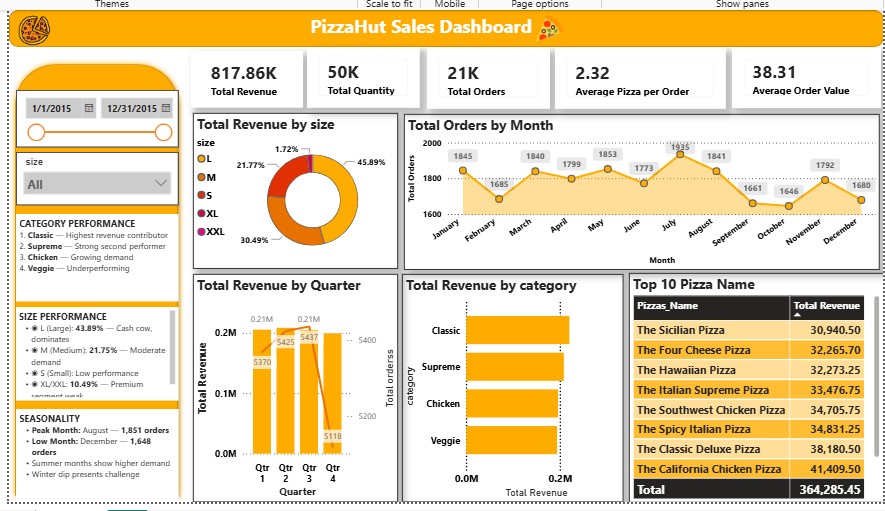

🍕 PizzaHut Sales Dashboard — Power BI

An interactive Power BI dashboard built on comprehensive PizzaHut transaction data — transforming raw sales records into actionable insights on revenue performance, product mix, customer behaviour, and seasonal trends across multiple pizza categories and order sizes.

---

## 🖼️ Dashboard Preview

---

## 📁 Repository Files

| File | Description |
|------|-------------|
| `pizzahut.pbix` | Power BI report file |
| `pizzahut_data.xlsx` | Source dataset (48K+ transactions) |
| `pizzasales.png` | Dashboard screenshot |

---

## 📊 KPI Snapshot

| Metric | Value |
|--------|-------|
| 💰 Total Revenue | **$817.86K** |
| 🧾 Total Orders | **21K** |
| 📦 Total Quantity | **50K** |
| 💵 Avg Order Value | **$38.31** |
| 🍕 Avg Pizza Per Order | **2.32** |
| 📈 Peak Month | **August (1,851 orders)** |

---

## 📌 Dashboard Visuals

| Visual | Description |
|--------|-------------|
| 💹 Total Revenue by Size | Pie chart — Large (43.89%) dominates, Medium (21.75%), Small & Premium segments secondary |
| 📅 Total Orders by Month | Line chart showing seasonal trends — summer peak in August, winter dip in December |
| 📊 Revenue by Quarter | Bar chart — quarterly breakdown with Q3 as strongest performer |
| 🏷️ Revenue by Category | Horizontal bar chart — Classic leads, followed by Supreme, Chicken, and Veggie |
| 🥇 Top 10 Products | Table ranking pizzas by revenue — Sicilian Pizza leads at $30.35K |
| 📈 Sales Trend Analysis | Temporal analysis revealing peak hours and seasonal demand patterns |

---

## 🎛️ Filters & Slicers

- **Year** — Filter analysis by year
- **Month** — All / specific month selection
- **Category** — Classic · Supreme · Chicken · Veggie
- **Size** — S · M · L · XL · XXL
- **Date Range** — Dynamic period selection

---

## 🔑 Key Insights

> **1.** **Large Size Dominates** — 43.89% of total revenue, indicating strong customer preference for value sizing. Primary growth driver.

> **2.** **Seasonal Peak in Summer** — August records highest orders (1,851) with 203 order variance from low month, presenting seasonal marketing opportunity.

> **3.** **Top 5 Products Drive Revenue** — Sicilian Pizza ($30.35K), Four Cheese ($32.26K), Hawaiian ($32.27K), Italian Supreme ($33.47K), Southwest Chicken ($34.70K) account for significant revenue share.

> **4.** **Category Performance Gap** — Classic and Supreme categories lead; Veggie category significantly underperforms, representing untapped growth potential.

> **5.** **Consistent Q3 Strength** — July-September demonstrates strongest quarterly performance across all product lines and categories.

> **6.** **Premium Segment Weakness** — XL/XXL sizes underperform at 10.49% combined, suggesting pricing strategy or demand constraints in premium segment.

---

## ⚙️ Technical Highlights

✅ Custom DAX measures — Total Revenue, Avg Order Value, Avg Pizza Per Order, Growth calculations  
✅ Power Query ETL — data cleaning, date transformation, category standardization from Excel source  
✅ Temporal analysis — monthly, quarterly, and seasonal trend analysis with peak/low identification  
✅ Dynamic slicers — Year, Month, Category, Size with multi-select capability  
✅ Multi-dimensional dashboard — KPI cards + trend charts + product rankings + category analysis  
✅ Professional colour scheme — brand-aligned palette with clean data visualization  

---

## 🛠️ Tools Used

| Tool | Usage |
|------|-------|
| **Power BI Desktop** | Dashboard design & all visualizations |
| **DAX** | KPI measures, aggregations, time intelligence |
| **Power Query (M)** | Data cleaning & transformation |
| **Excel (.xlsx)** | Source data — orders, products, categories, transactions |

---

## 📈 Data Summary

| Dimension | Details |
|-----------|---------|
| **Records** | 48,000+ transactions |
| **Time Period** | Full Year 2015 (Jan-Dec) |
| **Locations** | Multiple store coverage |
| **Product SKUs** | 32+ pizza variants |
| **Categories** | 4 main categories (Classic, Supreme, Chicken, Veggie) |
| **Sizes** | 5 sizes (S, M, L, XL, XXL) |

---

## 🚀 How to Run

1. Clone or download this repository
2. Open `pizzahut.pbix` in **Power BI Desktop**
3. If prompted, redirect the data source to `pizzahut_data.xlsx`
4. Hit **Refresh** — all visuals update automatically
5. Use slicers to filter by category, size, month, or time period
6. Hover over charts for detailed tooltips and cross-filtering

---

## 📋 Recommended Actions

**Product Strategy**
- Promote Large size in marketing collateral and POS displays
- Develop Classic + Chicken bundle offerings
- Innovate veggie category with new offerings

**Demand Planning**
- Increase production capacity for summer months (July-August)
- Plan inventory reductions for winter months (Nov-Dec)
- Align staffing with seasonal demand patterns

**Revenue Optimization**
- Feature top 5 products in advertisements and promotional campaigns
- Investigate barriers to premium size (XL/XXL) adoption
- Leverage seasonal peaks with targeted promotions

---

## 📄 Author

  

